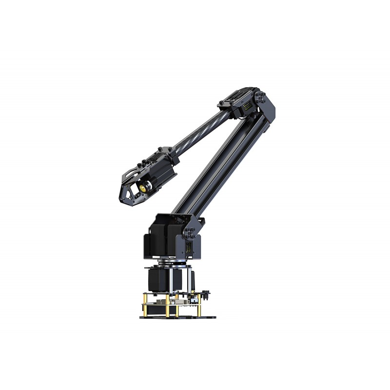
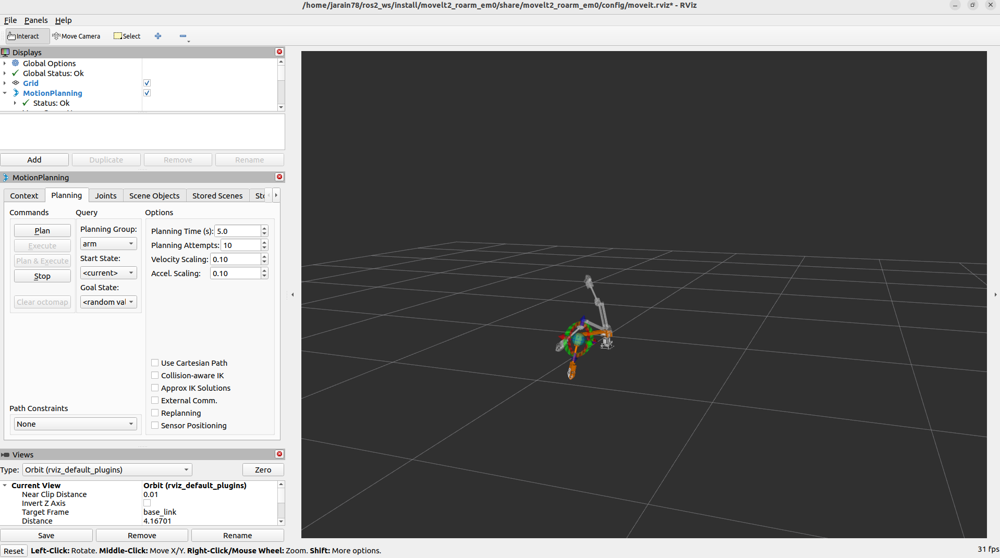

# RoARm Robot Movelt

---

### Introduction to Movel2 and the RoArm-M2-S Robotic Arm

The [RoArm-M2-S](https://www.waveshare.com/wiki/RoArm-M2-S) robotic arm, developed by [Movelt2](https://moveit.picknik.ai/main/index.html), represents a significant advancement in robotic manipulation technology. Movel2, a leading innovator in robotics, has designed the RoArm-M2-S to provide precise and versatile solutions for various applications ranging from industrial automation to educational purposes.

The RoArm-M2-S is engineered with state-of-the-art components, offering high precision and repeatability in its movements. This robotic arm features multiple degrees of freedom, enabling it to perform complex tasks with a high level of dexterity. Its robust design ensures durability and reliability, making it suitable for continuous operation in demanding environments.

One of the standout features of the RoArm-M2-S is its ease of integration with various control systems and programming environments. Movel2 has equipped the arm with advanced sensors and actuators, allowing for seamless integration into existing workflows and enabling users to achieve optimal performance in their specific applications.

In educational settings, the RoArm-M2-S serves as an excellent tool for teaching robotics and automation concepts. Its user-friendly interface and comprehensive documentation make it accessible for students and educators alike, providing a hands-on experience that enhances learning and fosters innovation.

Overall, the RoArm-M2-S robotic arm by Movel2 is a versatile and reliable tool that meets the needs of both industrial and educational users. Its advanced capabilities and ease of use make it a valuable asset in the ever-evolving field of robotics.






## Installation

Follow these steps to set up your environment and clone the repository:

```
sudo apt install ros-humble-moveit-visual-tools -y
sudo apt install ros-humble-moveit-setup-assistant -y
sudo apt install ros-humble-moveit -y
sudo apt install ros-humble-moveit-resources-fanuc-description -y
sudo apt install ros-humble-moveit-resources-fanuc-moveit-config -y
```

## For laucnh the movelt2_roarm_em0 project

ros2 launch movelt2_roarm_em0 demo.launch.py


[RoArm-M2-S](https://www.youtube.com/watch?v=x3iG262SEW0&lc=UgxfMQB3jESwzyWxrPN4AaABAg.A3rspvJhU13A3uX-SqHTB4)


